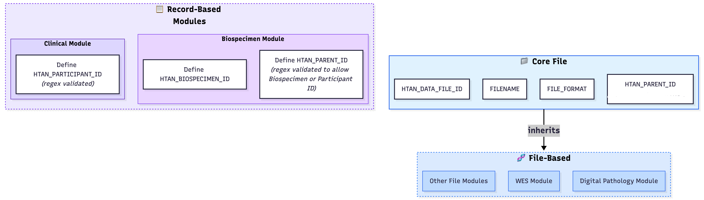

# HTAN Phase 2 Data Model (HTAN2)

---

This data model is in **active development**. It builds on **HTAN Phase 1** and incorporates input from the **Cancer Data Standards (CDS)** initiative. Expect frequent changes until a stable version is released.

---

## Overview 

This repository is part of ongoing efforts to refine and standardize the HTAN2 data model. 

## 🏗️ Data Model Architecture

The HTAN2 data model is built using **LinkML**, a modeling language for schemas that generates Python data model classes and JSON schemas. The model follows a modular architecture with clear separation of concerns:



The diagram above illustrates the separation between **Record-Based Modules** (Clinical, Biospecimen) and **File-Based Modules** (WES, Digital Pathology, etc.), with the **Core File Module** providing universal attributes for all file-based modules.

### **Core File Module**
- **Purpose**: Universal attributes shared across all file-based modules
- **Location**: `modules/CoreFile/domains/core.yaml`
- **Key Features**: 
  - Single primary key definition (`HTAN_DATA_FILE_ID`)
  - Required field definitions for relationships
  - HTAN identifier validation patterns
  - Base class for inheritance (`CoreFileAttributes`)

### **Clinical Module**
- **Purpose**: Clinical and demographic data
- **Location**: `modules/Clinical/`
- **Structure**: Multiple domain files (demographics, diagnosis, therapy, etc.)
- **Features**: Comprehensive validation rules and conditional requirements

### **Biospecimen Module**
- **Purpose**: Comprehensive biospecimen metadata and classification
- **Location**: `modules/Biospecimen/`
- **Structure**: 18 domain-specific enum files with medical classifications
- **Features**: RFC-compliant implementation with 39 core attributes, ICD-10/ICD-O-3 integration, UBERON tissue ontology

### **Sequencing Module**
- **Purpose**: Base sequencing attributes shared across all sequencing types
- **Location**: `modules/Sequencing/`
- **Structure**: BaseSequencingAttributes class with common sequencing metadata
- **Features**: Library layout enums, sequencing platform enums, workflow metadata

### **WES Module**
- **Purpose**: Bulk Whole Exome Sequencing data
- **Location**: `modules/WES/`
- **Structure**: Three processing levels (Level 1, 2, 3)
- **Features**: Sequencing platform enums, quality metrics, variant calling

### **scRNA-seq Module**
- **Purpose**: Single-cell RNA sequencing data
- **Location**: `modules/scRNA-seq/`
- **Structure**: Three data levels (Level 1, 2, 3/4) with h5ad format validation
- **Features**: Single-cell isolation methods, workflow types, AnnData schema compliance

### **Imaging Module**
- **Purpose**: Base imaging attributes shared across all imaging modules
- **Location**: `modules/Imaging/`
- **Structure**: BaseImagingAttributes class with common imaging metadata
- **Features**: De-identification methods, imaging equipment, microscopy parameters, quality control

### **Digital Pathology Module**
- **Purpose**: Whole-slide imaging (WSI) data from H&E and other tissue-based assays
- **Location**: `modules/DigitalPathology/`
- **Structure**: Single data level (Level 2) with Bio-Formats/OpenSlide compatible formats
- **Features**: Annotation support, slide label handling, CRDC alignment, format validation

### **Multiplex Microscopy Module**
- **Purpose**: Multiplexed tissue imaging assays (CODEX, CyCIF, IMC, MIBI, etc.)
- **Location**: `modules/MultiplexMicroscopy/`
- **Structure**: Three data levels (Level 2: imaging + channel metadata, Level 3: segmentation masks, Level 4: cell-by-feature tables)
- **Features**: Channel metadata, image dimensions, multiplex assay types, CRDC alignment

### **Spatial Omics Module**
- **Purpose**: Sequencing-based and sequence-hybridization spatial omics assays (Visium, Xenium, CosMx, STOmics, etc.)
- **Location**: `modules/SpatialOmics/`
- **Structure**: Four data levels (Level 1: raw data bundle optional, Level 3: processed bundle required, Level 4: interoperable file optional, Panel: panel information)
- **Features**: Platform flexibility, bundle-level metadata, panel information, QC metrics, conditional requirements

## 📁 Project Structure

```
htan2-data-model/
├── modules/                    # All data model modules
│   ├── CoreFile/              # Universal file attributes
│   ├── Clinical/              # Clinical data domains
│   ├── Biospecimen/           # Biospecimen metadata and classification
│   ├── Sequencing/            # Base sequencing attributes
│   ├── Imaging/               # Base imaging attributes
│   ├── WES/                   # Whole Exome Sequencing
│   ├── scRNA-seq/             # Single-cell RNA sequencing
│   ├── DigitalPathology/      # Digital Pathology imaging
│   ├── MultiplexMicroscopy/   # Multiplex Microscopy imaging
│   └── SpatialOmics/          # Spatial Omics assays
├── config/                    # LinkML configuration
├── scripts/                   # Utility scripts
├── tests/                     # Root-level tests
└── docs/                      # Documentation
```

## 🔗 Key Relationships

### **Data Hierarchy**
```
Participant (HTAN_PARTICIPANT_ID)
├── Biospecimen (HTAN_BIOSPECIMEN_ID)
│   └── Level 1 Data (HTAN_DATA_FILE_ID) → HTAN_PARENT_ID: _B####
│       └── Level 2 Data (HTAN_DATA_FILE_ID) → HTAN_PARENT_ID: _D####
│           └── Level 3 Data (HTAN_DATA_FILE_ID) → HTAN_PARENT_ID: _D####
```

### **Primary Keys**
- `HTAN_DATA_FILE_ID`: Unique identifier for data files across all levels

### **Required Fields (not primary keys in this context)**
- `HTAN_PARTICIPANT_ID`: HTAN ID associated with a patient
- `HTAN_BIOSPECIMEN_ID`: HTAN Biospecimen ID of the parent biospecimen

### **Foreign Keys**
- `HTAN_PARENT_ID`: References parent entity using suffix convention
  - `_B####` - References a biospecimen
  - `_D####` - References a data file

## 🚀 Getting Started

### **Prerequisites**
- Python 3.11+
- Poetry (dependency management)
- LinkML tools

### **Installation**
```bash
# Clone the repository
git clone <repository-url>
cd htan2-data-model

# Install dependencies
poetry install

# Generate schemas
make modules-gen

# Run tests
make test
```

## 📚 Module-Specific Documentation

Each module contains detailed documentation:

- **Core File Module**: See `modules/CoreFile/README.md` for primary/foreign key definitions
- **Clinical Module**: See `modules/Clinical/README.md` for domain descriptions
- **Biospecimen Module**: See `modules/Biospecimen/README.md` for RFC compliance and enum schemas
- **Sequencing Module**: See `modules/Sequencing/README.md` for base sequencing attributes
- **Imaging Module**: Base imaging attributes (no separate README, see DigitalPathology and MultiplexMicroscopy)
- **WES Module**: See `modules/WES/README.md` for sequencing levels
- **scRNA-seq Module**: See `modules/scRNA-seq/README.md` for single-cell RNA sequencing levels
- **Digital Pathology Module**: See `modules/DigitalPathology/README.md` for digital pathology imaging
- **Multiplex Microscopy Module**: See `modules/MultiplexMicroscopy/README.md` for multiplex microscopy imaging
- **Spatial Omics Module**: See `modules/SpatialOmics/README.md` for spatial omics assays

## 🤝 Contributing

For detailed contribution guidelines, development conventions, and step-by-step instructions for adding new modules, see **[CONTRIBUTING.md](CONTRIBUTING.md)**.

### **Quick Start for Contributors**
1. Fork the repository
2. Create feature branch: `git checkout -b feat/[module-name]`
3. Follow conventions in CONTRIBUTING.md
4. Run tests: `make test`
5. Submit pull request

## 📖 Additional Resources

- **LinkML Documentation**: [https://linkml.io/](https://linkml.io/)
- **HTAN Phase 1 (archived)**: [https://github.com/ncihtan/data-models](https://github.com/ncihtan/data-models)
- **Cancer Data Standards**: [https://cancer.gov/cancer-data-standards](https://cancer.gov/cancer-data-standards)


