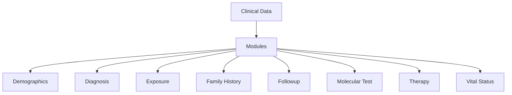

# HTAN LinkML Documentation

Welcome to the HTAN LinkML documentation. This documentation describes the data model for the Human Tumor Atlas Network (HTAN).

## Data Model Overview

The HTAN Clinical Data Model is organized hierarchically:

## Documentation Structure

This documentation is organized into the following sections:

1. **Modules**: Detailed documentation for each module in the data model
2. **Quick Start**: Get started with the HTAN LinkML data model
3. **Development**: Information for developers working with the data model

## Getting Started

To get started with the HTAN LinkML data model:

1. Explore the [Modules](modules/) documentation
2. Check out the [Development](development.md) guide for implementation details if you are contributing to the data model

## Contributing

We welcome contributions to the HTAN LinkML data model. Please see the [Development](development.md) guide for information on how to contribute.

## Modules

The HTAN LinkML model is organized into the following modules:

- [Demographics](Demographics.md)
- [Diagnosis](Diagnosis.md)
- [Exposure](Exposure.md)
- [Family History](FamilyHistory.md)
- [Followup](FollowUp.md)
- [Molecular Test](MolecularTest.md)
- [Therapy](Therapy.md)
- [Vital Status](VitalStatus.md)

## Resources

- [HTAN Website](https://humantumoratlas.org)
- [LinkML Documentation](https://linkml.io)
- [GitHub Repository](https://github.com/ncihtan/htan-linkml)