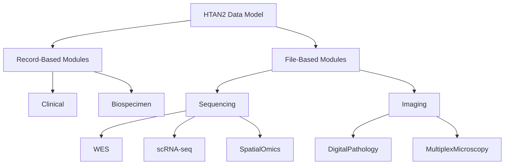

# HTAN Phase 2 Data Model

Welcome to the HTAN Phase 2 Data Model documentation. This documentation provides comprehensive guides and references for working with the Human Tumor Atlas Network (HTAN) data model.

## Overview

The HTAN Phase 2 Data Model is a comprehensive, modular data model built using **LinkML** for standardizing cancer research data. It supports multiple data types including clinical records, biospecimens, sequencing data, and imaging data.


```mermaid
graph TD
    A[HTAN2 Data Model] --> B[Record-Based Modules]
    A --> C[File-Based Modules]
    B --> D[Clinical]
    B --> E[Biospecimen]
    C --> F[Sequencing]
    C --> G[Imaging]
    F --> H[WES]
    F --> I[scRNA-seq]
    F --> J[SpatialOmics]
    G --> K[DigitalPathology]
    G --> L[MultiplexMicroscopy]
```

## Quick Links

- **[Getting Started](getting-started.md)** - New to HTAN2? Start here
- **[Module Overview](modules/overview.md)** - Understand the module architecture
- **[Contributing](contributing.md)** - How to contribute to the data model

## Module Documentation

### Record-Based Modules
Modules that represent clinical and biospecimen records:

- **[Clinical](modules-readmes/clinical.md)** - Clinical and demographic data
  - [Schema Reference](generated/clinical/index.md)
- **[Biospecimen](modules-readmes/biospecimen.md)** - Biospecimen metadata and classification
  - [Schema Reference](generated/biospecimen/index.md)

### File-Based Modules
Modules that represent data files with hierarchical levels:

#### Sequencing Modules
- **[Sequencing Base](modules-readmes/sequencing.md)** - Base sequencing attributes
  - [Schema Reference](generated/sequencing/index.md)
- **[WES](modules-readmes/wes.md)** - Whole Exome Sequencing (3 levels)
  - [Schema Reference](generated/wes/index.md)
- **[scRNA-seq](modules-readmes/scrna-seq.md)** - Single-cell RNA sequencing
  - [Schema Reference](generated/scrna-seq/index.md)

#### Imaging Modules
- **[Imaging Base](modules-readmes/imaging.md)** - Base imaging attributes
  - [Schema Reference](generated/imaging/index.md)
- **[Digital Pathology](modules-readmes/digitalpathology.md)** - Whole-slide imaging data
  - [Schema Reference](generated/digitalpathology/index.md)
- **[Multiplex Microscopy](modules-readmes/multiplexmicroscopy.md)** - Multiplexed tissue imaging
  - [Schema Reference](generated/multiplexmicroscopy/index.md)

#### Spatial Omics
- **[Spatial Omics](modules-readmes/spatialomics.md)** - Spatial omics assays
  - [Schema Reference](generated/spatialomics/index.md)

### Core Modules
- **[Core File](modules-readmes/corefile.md)** - Universal file attributes
  - [Schema Reference](generated/corefile/index.md)

## Key Concepts

### Data Hierarchy

```
Participant (HTAN_PARTICIPANT_ID)
├── Biospecimen (HTAN_BIOSPECIMEN_ID)
│   └── Level 1 Data (HTAN_DATA_FILE_ID) → HTAN_PARENT_ID: _B####
│       └── Level 2 Data (HTAN_DATA_FILE_ID) → HTAN_PARENT_ID: _D####
│           └── Level 3 Data (HTAN_DATA_FILE_ID) → HTAN_PARENT_ID: _D####
```

### Primary Identifiers

- **`HTAN_DATA_FILE_ID`**: Unique identifier for all data files
- **`HTAN_BIOSPECIMEN_ID`**: Unique identifier for biospecimens
- **`HTAN_PARTICIPANT_ID`**: Unique identifier for participants

### Foreign Keys

- **`HTAN_PARENT_ID`**: References parent entity
  - `_B####` - References a biospecimen
  - `_D####` - References a data file

## Resources

- [HTAN Website](https://humantumoratlas.org)
- [LinkML Documentation](https://linkml.io)
- [GitHub Repository](https://github.com/ncihtan/htan2-data-model)
- [Contributing Guide](https://github.com/ncihtan/htan2-data-model/blob/main/CONTRIBUTING.md)
